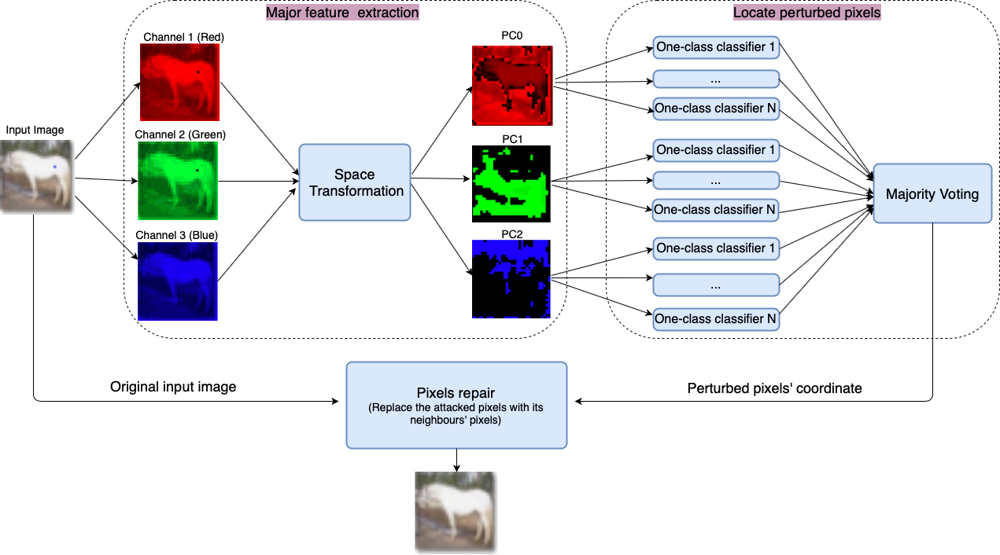
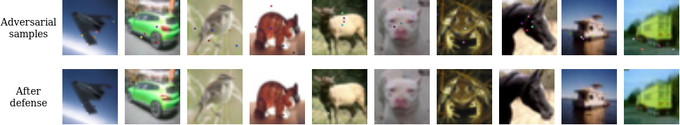
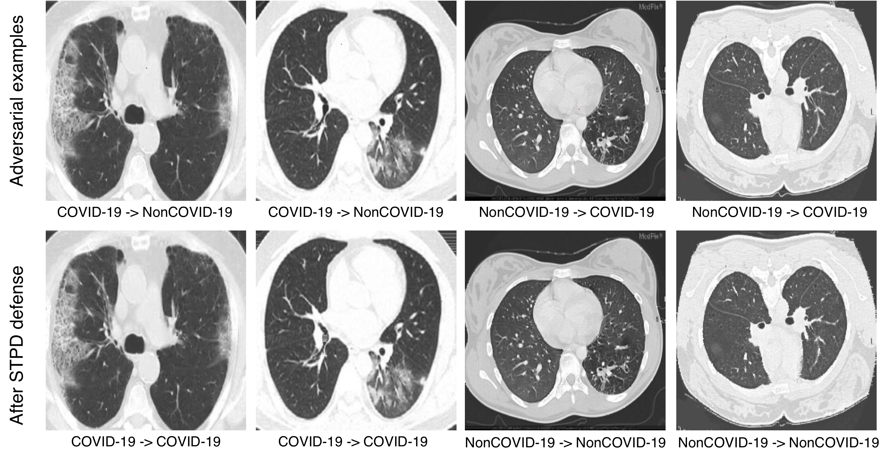
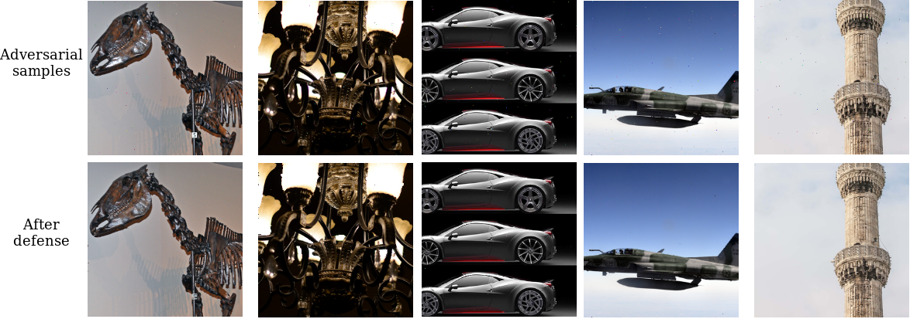

## Defending Against L0-norm Attacks with Space Transformation

### Overview

- Framework


- CIFAR10 
<p align="center">



</p>

- COVID-CT
<p align="center">



</p>


- ImageNet

<p align="center">



</p>

### Prerequisite

- Juputer Notebook is highly recommended as you can easily show the experiment result.
    ```
    pip3 install jupyter
    ```
- We have tested our code under the following settings:<br/>

    | Python | TensorFlow | CUDA | cuDNN |
    | :----: | :--------: | :--: | :---: |
    |  2.7   |  1.3       | 8.0  |  5.1  |
    |  3.6   |  1.13      | 10.0  |  7.5  |

### Experiments
#### 1. Collect Adversarial Samples
#### 1.1 CIFAR10 Test Dataset
- Start collecting non-targeted adversarial samples to fool DNNs
    ```    
    python ./attacks/exp1-non-targeted_attacks_collection.py 1
    or
    exp1_non-targeted_data_collection.ipynb
    ```
    > `num of pixel`: you can input any number of pixels to attack DNNs.

- Start collecting targeted adversarial samples to fool DNNs
    ```    
    exp3_targeted_data_collection.ipynb
    ```    

* The adversarial samples and clean images also can be downloaded at [Google Drive](https://drive.google.com/file/d/1nq8d_RCLbIvIg3-_FYBo6roirc6NUP5r/view?usp=sharing) 

##### Defense

* Download the adversarial samples from Google Drive or generate it from the code.    

* Using our defense system to restore the input images before given to DNNs.
    ```    
    run exp5_our_defense.ipynb
    ```        
* Testing the Top-1 accuracy after applying our defense technique.
    ```    
    run exp6_DNNs_reclass.ipynb
    ```    

#### 1.2 ImageNet Dataset.
* Download the 1000 Imagenet dataset from the following link:
[https://www.kaggle.com/benhamner/adversarial-learning-challenges-getting-started/data](https://www.kaggle.com/benhamner/adversarial-learning-challenges-getting-started/data)

* Start collecting non-targeted adversarial samples to fool Inception-V3

    ```    
    run exp4_imageNet_data_collection.ipynb
    ```    
* Using our defense system to restore the input images before given to DNNs.
    ```    
    run exp5_our_defense.ipynb
    ``` 
* The adversarial samples and clean images also can be downloaded at [Google Drive](https://drive.google.com/file/d/1-XmPEusrKYZArtMrDTsHRHPUwjs-nj1p/view?usp=sharing) 

* Testing the Top-1 accuracy after applying our defense technique.
    ```    
    run exp7_imageNet_reclass.ipynb
    ```      

#### 1.3 Defense Metric

We proposed SDR and EDR metric to compare with different baselines defense performance.

* Success Defense Rate(SDR) - the percentage of successful defense after applying defense techniques to the adversarial samples. Where a is the number of successful defense samples, and N1 is the total number of adversarial samples. The higher the score is, the better the defense performance is.

<p align="center">

</p>

* Error Defense Rate (EDR) - the percentage of error defense images, which are clean but suffering from mis-classification after applying the defense method. Where b is the number of error defense images, and N2 indicates total number of clean images. A lower score indicates better defense performance.

<p align="center">

</p>

#### Acknowledgement
* The one-pixel attack for adversarial samples collection is modified from [one-pixel-attack-keras](https://github.com/Hyperparticle/one-pixel-attack-keras)

